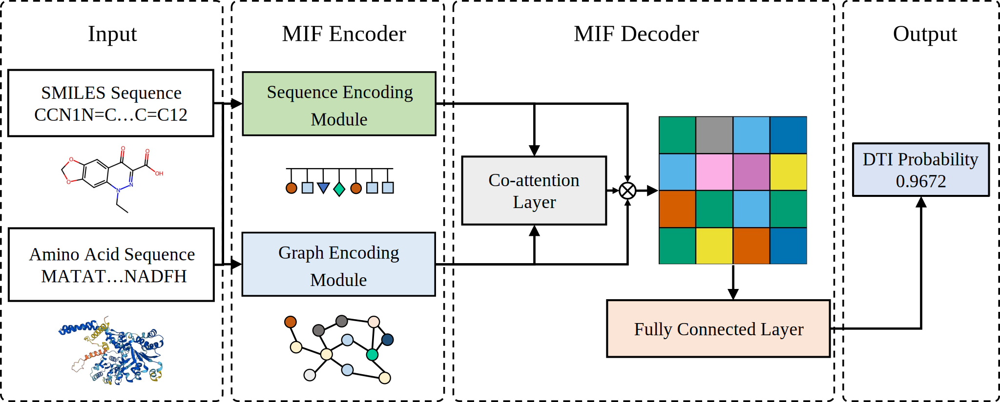

# MIF-DTI
MIF-DTI: a multimodal information fusion method for drug-target interaction prediction

# Dependencies:
torch==2.4.1

torch_geometric

pyg_lib

torch_scatter

joblib

numpy

prefetch_generator

scikit-learn

tqdm

pandas

fair-esm

Bio

rdkit

# Resources:
README.md: this file.

requirements.txt:  dependencies.

DataSets: DrugBank.txt, Davis.txt, BioSNAP.txt, BD2D.txt **(for cross-dataset validation)**.

RunModel.py: train and test the model.

main.py: main process.

model.py: MIF-DTI and MIF-DTI-B model architecture.

# Run:
python -u main.py [dataset] -m [model]
